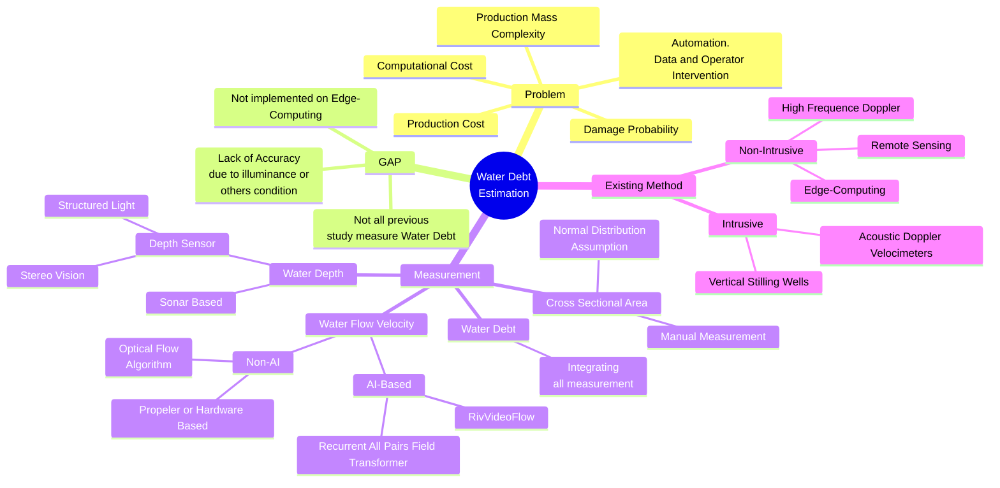
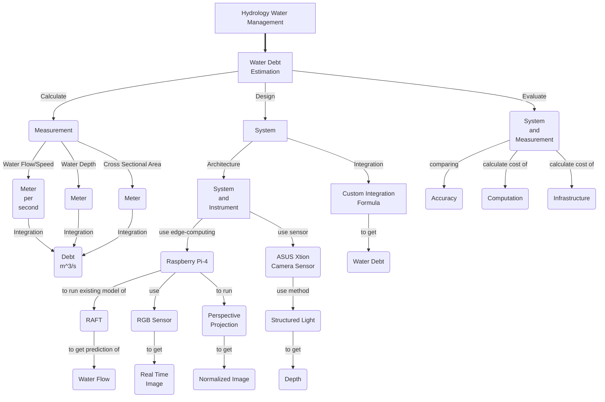

ID: 20924305
Name: Gia Muhammad Agusta

### 1. Mind Map and Concept Map
### Judul: Implementasi Estimasi Debit Air Sungai berbasis *AI* pada sistem *Edge-Computing*
### Title: Implementation of River Water Debt Estimation AI based on Edge-Computing system
## Mindmap

### ConceptMap

### 2. Data Science and Python Env
### a. Explain in brief about data science
#### Answer

Data Science adalah bidang interdisipliner yang menggunakan metode ilmiah, proses, algoritma, dan sistem untuk mengekstrak pengetahuan serta wawasan dari data terstruktur maupun tidak terstruktur. Bidang ini menggabungkan teknik dari statistika, ilmu komputer, pembelajaran mesin (machine learning), dan keahlian domain untuk menganalisis, menginterpretasi, dan memvisualisasikan data kompleks guna mendukung pengambilan keputusan. 

Reference
- Dhar, V. (2013). "Data Science and Prediction." Communications of the ACM, 56(12), 64-73.

### b. What are the differences between data, data science, and data scientist?
#### Answer

Data:
Data adalah fakta mentah, angka, teks, gambar, atau sinyal yang belum diolah. Data merupakan elemen fundamental dalam seluruh proses analisis. Data berupa fakta mentah, angka, teks, gambar, atau bahkan rekaman suara yang belum memiliki makna spesifik. Contohnya transaksi harian toko, hasil kuesioner, log aktivitas pengguna aplikasi, atau data sensor dari perangkat IoT. Data bisa terstruktur (seperti tabel database) atau tidak terstruktur (seperti postingan media sosial). Tanpa data, tidak dapat dianalisis, analoginya data seperti bahan baku yang harus diolah lebih lanjut untuk menghasilkan nilai atau insight.

Data Science:
Data science adalah disiplin ilmu yang menggabungkan metode statistika, pemrograman komputer, dan pengetahuan domain untuk mengekstrak pola, prediksi, atau insight dari data. Prosesnya meliputi pengumpulan data, pembersihan (cleaning), eksplorasi (EDA), pemodelan (machine learning), visualisasi hasil hingga intepretasi menjadi pengetahuan baru. Contoh penerapannya sangat luas, mulai dari sistem rekomendasi (seperti pada algoritma aplikasi TV, e-Commerce, musik dan lainnya), deteksi fraud kartu kredit, hingga prediksi tren pasar saham. Data science tidak hanya berfokus pada teknis analisis, tetapi juga pada cara menyampaikan temuan secara efektif kepada stake-holder.

Data Scientist:
Data scientist adalah individu yang memiliki keahlian untuk menjalankan seluruh rangkaian proses data science. Tugasnya mencakup merancang algoritma, membangun model prediktif, hingga menerjemahkan hasil analisis menjadi rekomendasi bisnis yang actionable. Seorang data scientist harus menguasai keterampilan teknis (seperti Python/R, SQL, dan machine learning) sekaligus kemampuan komunikasi untuk menjelaskan temuan kompleks dengan bahasa sederhana. Misalnya, mereka mungkin mengembangkan model untuk memprediksi churn pelanggan atau mengoptimalkan rantai pasok berdasarkan data historis. Peran ini sering disebut sebagai "pekerjaan terseksi abad ke-21" karena permintaannya yang tinggi di berbagai industri khususnya pada industri yang sudah berjalan hingga sudah menghasilkan data.

Referece
- Davenport, T. H., & Patil, D. J. (2012). *Data Scientist: The Sexiest Job of the 21st Century.* Harvard Business Review, 90(10), 70–76.
- Cao, L. (2017). *Data Science: A Comprehensive Overview*. ACM Computing Surveys, 50(3), 1–42.

### c. Explain about the four foundational aspects of data science?
#### Answer
4 Fondasi dari aspek Data Science diantaranya adalah Matematika, Teknologi, Pengetahuan Domain dan Komunikasi Visual Data
- Matematika:
  Fondasi matematika yang terdiri dari kalkulus, aljabar linier, statistika dan probabilitas. Kalkulus dan aljabar linier memberikan pemahaman dari mekanisme atau metode-metode Machine Learning (dahulu lebih dikenal statistik inferensial untuk jenis parametrik), Kalkulus dan Aljabar linier di Machine Learning umumnya digunakan untuk mencari garis pemisah (khususnya pada kategori klasifikasi) konvergensi dari masalah pengenalan pola, digunakan untuk mencari global optimum dan tidak terjebak dalam lokal optimum. Sedangkan Statistik dan probabilitas membentuk tulang punggung analitis yang memberikan kerangka kerja untuk memahami pola dan ketidakpastian dalam data. Pada beberapa metode machine learning tertentu menggunakan statistika dan probabilitas (contoh: Naive Bayes). Tanpa pemahaman mendalam tentang distribusi data, uji hipotesis, dan regresi, seluruh proses analisis akan kehilangan dasar ilmiahnya. Para praktisi data science harus mampu membedakan antara korelasi dan kausalitas, serta memahami prinsip sampling yang tepat.

- Teknologi:
  Ilmu komputer dan pemrograman berperan sebagai alat utama untuk mengimplementasikan teori statistika menjadi solusi nyata. Kemampuan mengolah dataset besar membutuhkan penguasaan bahasa pemrograman seperti Python atau R, serta framework seperti Pandas dan NumPy. Aspek ini juga mencakup pemahaman tentang struktur data, algoritma, dan optimasi kode untuk menangani big data secara efisien. Tantangan komputasi seperti parallel processing dan manajemen memori menjadi bagian krusial dalam fondasi ini khususnya pada metode Machine Learning yang mutakhir seperti Deep Learning atau pada jumlah Data yang sangat besar.

- Pengetahuan Domain:
  Pengetahuan domain atau bisnis berfungsi sebagai kompas yang mengarahkan analisis ke masalah yang benar-benar relevan. Seorang data scientist di bidang kesehatan harus memahami terminologi medis, sementara yang bekerja di fintech perlu mengerti regulasi keuangan. Tanpa pemahaman domain yang mendalam, analisis yang canggih sekalipun bisa menghasilkan insight yang tidak aplikatif atau bahkan menyesatkan.

- Komunikasi Visual Data:
  Komunikasi dan visualisasi data menjadi jembatan antara hasil analisis teknis dengan pengambilan keputusan. Fondasi ini meliputi seni menyajikan temuan kompleks dalam bentuk dashboard, grafik interaktif, atau laporan eksekutif yang mudah dipahami. Kemampuan bercerita dengan data (data storytelling) menjadi pembeda antara analis biasa dengan praktisi kelas dunia, karena nilai sebenarnya dari data science terletak pada kemampuannya memengaruhi keputusan bisnis.

Reference
- Provost, F., & Fawcett, T. (2013). *Data Science for Business: What You Need to Know About Data Mining and Data-Analytic Thinking*. O’Reilly Media.

### d. List link on PyPI for installing JupyterNotebook, Matplotlib, NumPy.
- Link untuk matplotlib: https://pypi.org/project/matplotlib/
- Link untuk jupyter notebook: https://pypi.org/project/notebook/
- Link untuk Numpy: https://pypi.org/project/numpy/

### e. Create a virtual environment, install some packages, and save information to requirements.txt, create other virtual environment and use requirement.txt. Show the screenshots for all processes.

- Create a virtual environment

- Install some packages:

- Save information packages to requirements.txt

- create other virtual environment
 

- Use requirements.txt to install saved list of packages

### 3. Practicing Python for ML

https://github.com/giamuhammad/ITB_MSK_SK5004_MLAI_2025.1/blob/main/Assignment_w11/Assignment_w11.ipynb

