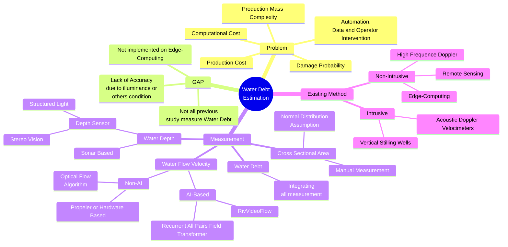
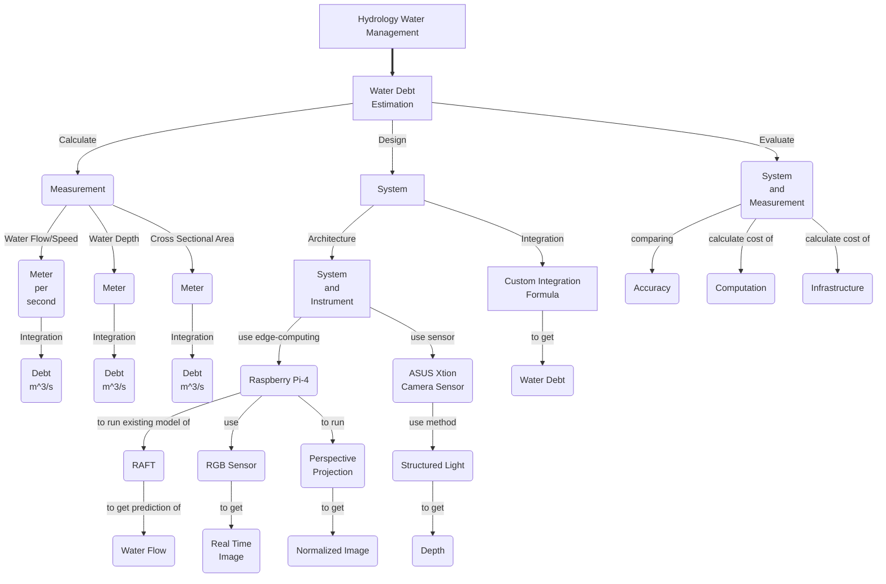

ID: 20924305
Name: Gia Muhammad Agusta

# 1. Mind Map and Concept Map:
# Implementasi Estimasi Debit Air Sungai berbasis *AI* pada sistem *Edge-Computing*
# Implementation of River Water Debt Estimation AI based on Edge-Computing system
# Mindmap

# ConceptMap
