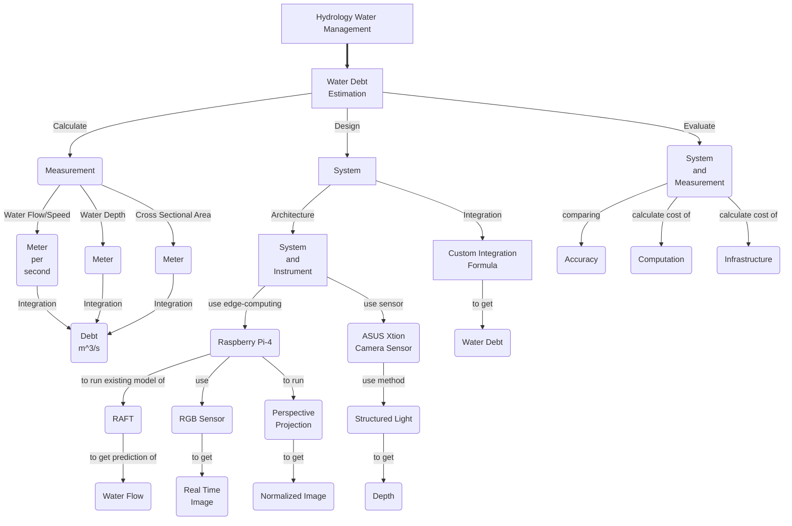

### 1. Mind Map and Concept Map
### Judul: Implementasi Estimasi Debit Air Sungai berbasis *AI* pada sistem *Edge-Computing*
### Title: Implementation of River Water Debt Estimation AI based on Edge-Computing system
### ConceptMap
